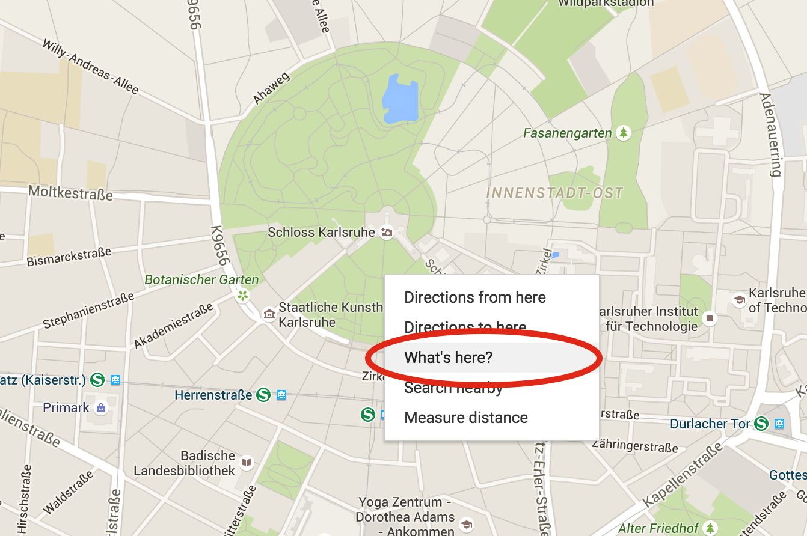
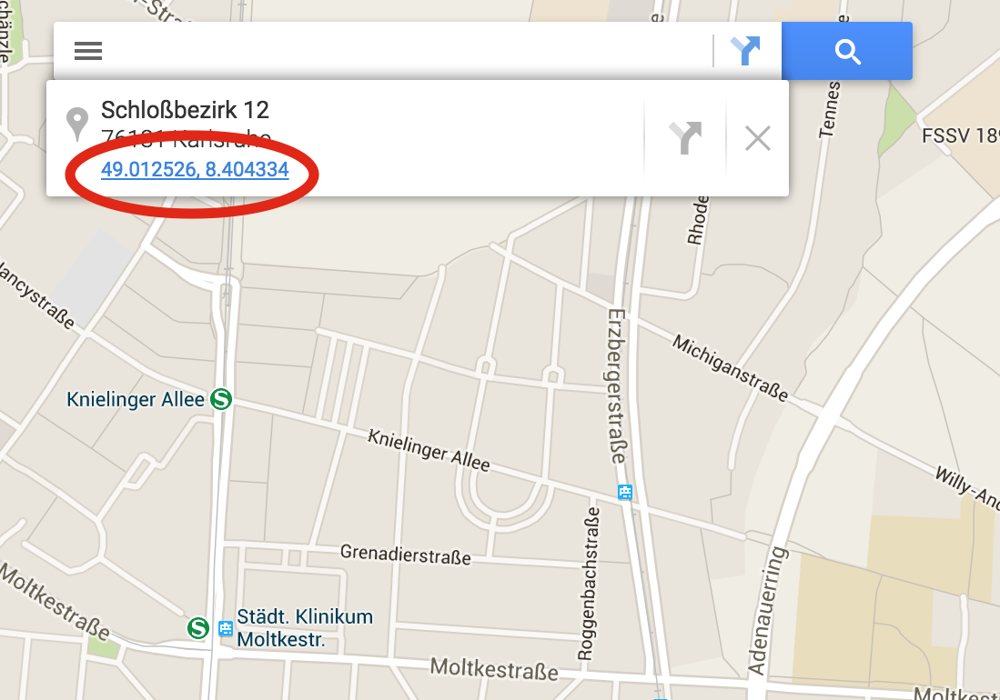
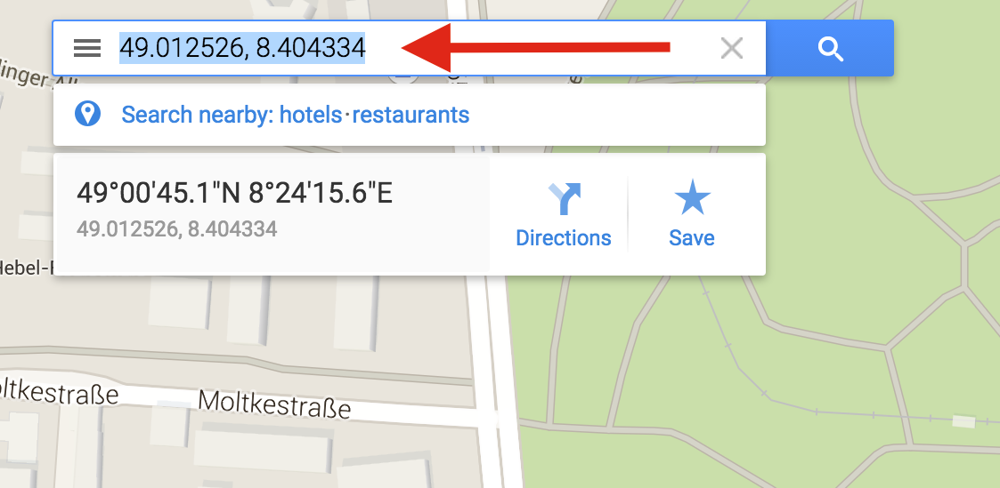

# Aufgabe: Kartenapp mit LeafletJS

Heute lernst du, wie man Code, den andere bereits mal geschrieben haben, für deine eigene Webseite verwenden und benutzen kannst. Solche Programme, die du für deine Entwicklung nutzen kannst, heißen _Library_ oder _Framework_. Wir schauen uns heute [leafletjs.com](http://leafletjs.com) an um eine Webseite zu entwickeln. 

**Geh zuerst auf http://sciencecampinformatik.github.io/2015/ und schaut euch die Demo-Seite an, wie es aussehen soll.**

**Lade auf http://sciencecampinformatik.github.io/2015/ das Template herunter mit dem wir arbeiten werden.**

## Erste Erfahrungen mit Leaflet JS
Leaflet ist ein sogennantes Open Source Projekt. Open Source Projekte sind Projekte, deren Code öffentlich ist und jeder, der will, mitarbeiten kann. In dieser Hinsicht ist es ein wenig wie Wikipedia, wo jeder der möchte, Beiträge schreiben kann.

Leaflet bietet uns die Möglichkeit, mit JavaScript ganz einfach eine Karte in unsere Webseite einzubauen. Um Leaflet zu benutzen müssen wir erstmal Leaflet in unsere Webseite einbauen. Nutze dafür das Template `map.html`.

**Binde Leaflet in deine Webseite ein**

1. Besuche leafletjs.com. Im [Quick Start Guide](http://leafletjs.com/examples/quick-start.html) gibt es einen Abschnitt, der heißt _Preparing your page_. 
2. Folge den Anweisungen unter _Preparing your page_. Falls du Hilfe mit der englischen Sprache brauchst, wende dich einfach an uns.
3. Wir wollen, dass die Karte bei uns nicht nur 180px hoch ist, sondern die komplette Seite einnimmt. Ändere das.

Leaflet ist jetzt korrekt eingebunden und kann benutzt werden! Auf der [Startseite von leafletjs.com](http://leafletjs.com/) ist ein Beispiel Code gegeben. Dieser Code ist JavaScript.

**Probiere den Beispiel Code aus**

1. Erstelle eine Datei namens `map.js`.
2. Binde `map.js` in deiner Webseite ein.
3. Schreibe den Beispielcode in `map.js`

Jetzt hast du LeafletJS erfolgreich benutzt! Wir wollen die Karte ein wenig anpassen.

**Verändere den Code so, dass die Karte Karlsruhe anzeigt.**

1. Lösche den Marker in London. Wir brauchen diesen nicht.
    * Schau dir den Beispielcode genau an. 
    * Welcher Teil erstellt den Marker und das Popupfenster? 
    * Wenn du es gefunden hast, entferne den Code.
2. Zentriere nun die Karte auf Karlsruhe
    * Welche Funktion könnte dafür verantwortlich sein?  
    * Suche in der [Docs von Leaflet](http://leafletjs.com/reference.html) nach dieser Funktion und versuche zu verstehen, wie sie funktioniert. (Das ist nicht einfach zu verstehen. Frag nach Hilfe!)
3. Um Leaflet sinnvoll zu benutzen brauchst du immer wieder Koordinaten von Orten. Du kannst dafür GoogleMaps benutzen
    * Mache einen Rechts-klick auf den Ort, dessen Koordinate du willst
    * Klicke auf _Whats' here?_  
    * Klicke auf die Koordinate, die nun am Suchfenster erscheint  
    * Kopiere dir die Koordinate  
* Verändere nun den Code so, dass die Karte auf Karlsruhe zentriert ist.

**Setze nun verschiedene Marker auf die Seite.**

1. Schau dir nochmal den Code an, den wir vorhin gelöscht haben.
2. Verwende ihn wieder im Marker auf die Karte zu setzen.
    * Falls du die gleichen Marker wie in der Demo haben möchtest, findest du hier die Koordinaten:
        * var infobau = [49.013817, 8.419790];
        * var schlosspark = [49.013149, 8.404364];
        * var klinikum = [49.015609, 8.374574];
        * var gameforge = [49.019921, 8.440989];
        * var his = [49.010194, 8.418930]; 

_Tipp: Schreibe die Koordinaten nicht direkt in den Marker rein, sondern definiere erst Variablen mit den Koordinaten und benutze dann diese._

## Navigationsangaben

Nun wollen wir auch die Route zwischen zwei Orten berechnen. Leaflet selbst bietet nicht die Möglichkeit, Routen zu berechnen. Daher benutzen wir wieder eine andere Library. Sie nennt sich _Leaflet Routing Machine_. Der Code der Library befindet sich bereits in eurem Template.

**Binde Leaflet Routing Machine ein.**

1. Gehe auf die Webseite http://www.liedman.net/leaflet-routing-machine/
2. Suche den Abschnitt _Getting Started_ und binde die Library entsprechend ein
    * Im Beispiel auf der Webseite wird zusätzlich zu Leaflet Routing Machine auf Leaflet eingebunden - da wir Leaflet bereits eingebunden haben, brauchen wir nur 2 der 4 Codezeilen. Welche sind das?
    * Im Beispiel wird die Datei `leaflet-routing-machine.js` eingebunden. Diese befindet sich bei uns allerdings im Unterordner `js/leaflet-routing-machine-2.3.0`. Passe den Code entsprechend an.
3. Teste Leaflet Routing Machine, indem du den Beispielcode kopierst und bei dir im JavaScript-Code einfügst.
4. Ändere den Beispielcode, sodass eine Route zwischen Markern berechnet wird, die du bereits gesetzt hast.

## Verschiedene Routen anzeigen
Auf der Demoseite siehst du, dass in der 3. Version eine Route zwischen dem Infobau und einem anderen Marker berechnet wird. Wenn du auf den Button "Nächste Route" klickst, wird eine andere Route startend vom Infobau angezeigt.

**Versuche dies nachzubauen**

1. Du brauchst einen Button, der eine Funktion in JavaScript aufruft.
2. Schreibe diese Funktion, die aufgerufen wird. Lass die Funktion zunächst erstmal leer.
3. Bestimme einen Marker, der immer dein Startpunkt sein wird.
4. Erstelle ein Array, welches verschiedene Koordinaten hat, zu dem die Route berechnet wird.
5. Schreibe die Funktion, sodass immer ein neues Ziel gewählt wird.
6. Erweitere die Funktion nun, sodass die Route zwischen Start und dem neuen Ziel berechnet wird.

_Tipp: Ein neues Ziel im Array zu bestimmen, wenn man auf einen Button klickt, funktioniert sehr ähnlich wie in der Bildergalerie._

## Sonstiges
Du kannst auch andere Kartendesigns für deine Webseite wählen. Diese Designs nennt man für Karten "Vector Tiles". Normalerweise kosten Vector Tiles Geld, weil es sehr teuer ist, die vielen Bilder zu hosten. Einige sind allerdings kostenlos. Ihr dürft allerdings auf keinen Fall die Attribution dieser Tiles löschen.

Eine Attribution ist ein Hinweis, von wem die Tiles eigentlich kommen, die du benutzt. Außerdem wird in der Attribution erklärt unter welchen rechtlichen Bedingungen du die Vector Tiles benutzen darfst. Eine Attribution ist quasi ein fairer Tausch - du darfst die Vector Tiles kostenlos benutzen, dafür musst du aber auch angeben, von wem die Tiles kommen. Die Attribution siehst du unten rechts in deiner Karte.

Dies ist ein üblicher Vorgang in der Open Source Welt. Hier sind mögliche Tiles, die du benutzen darfst. Probiere sie aus und wähle dein Lieblingsdesign:

```
L.tileLayer('http://a.tile.openstreetmap.fr/hot/{z}/{x}/{y}.png', {
    attribution: '&copy; <a href="http://osm.org/copyright">OpenStreetMap</a> contributors | Tiles by <a href="http://hot.openstreetmap.org/">HOT</a>'
}).addTo(map);
```

```
L.tileLayer('http://{s}.tile.osm.org/{z}/{x}/{y}.png', {
    attribution: '&copy; <a href="http://osm.org/copyright">OpenStreetMap</a> contributors'
}).addTo(map);
```

```
L.tileLayer('http://otile1.mqcdn.com/tiles/1.0.0/map/{z}/{x}/{y}.jpg', {
    attribution: 'Tiles Courtesy of <a href="http://www.mapquest.com/" target="_blank">MapQuest</a> , &copy; Data by <a href="http://openstreetmap.org">OpenStreetMap</a>, under <a href="http://www.openstreetmap.org/copyright">ODbL</a>.'
}).addTo(map);
```

```
L.tileLayer('http://c.tile.stamen.com/toner/{z}/{x}/{y}.png', {
    attribution: 'Map tiles by <a href="http://stamen.com">Stamen Design</a>, under <a href="http://creativecommons.org/licenses/by/3.0">CC BY 3.0</a>. Data by <a href="http://openstreetmap.org">OpenStreetMap</a>, under <a href="http://www.openstreetmap.org/copyright">ODbL</a>.'
}).addTo(map);
```

```
L.tileLayer('http://c.tile.stamen.com/watercolor/{z}/{x}/{y}.png', {
    attribution: 'Map tiles by <a href="http://stamen.com">Stamen Design</a>, under <a href="http://creativecommons.org/licenses/by/3.0">CC BY 3.0</a>. Data by <a href="http://openstreetmap.org">OpenStreetMap</a>, under <a href="http://www.openstreetmap.org/copyright">ODbL</a>.'
}).addTo(map);
```

**Falls du nicht weiterkommst, kannst du uns gerne fragen oder auf der Demoseite von sciencecampinformatik.github.io/2015 nachschauen.**